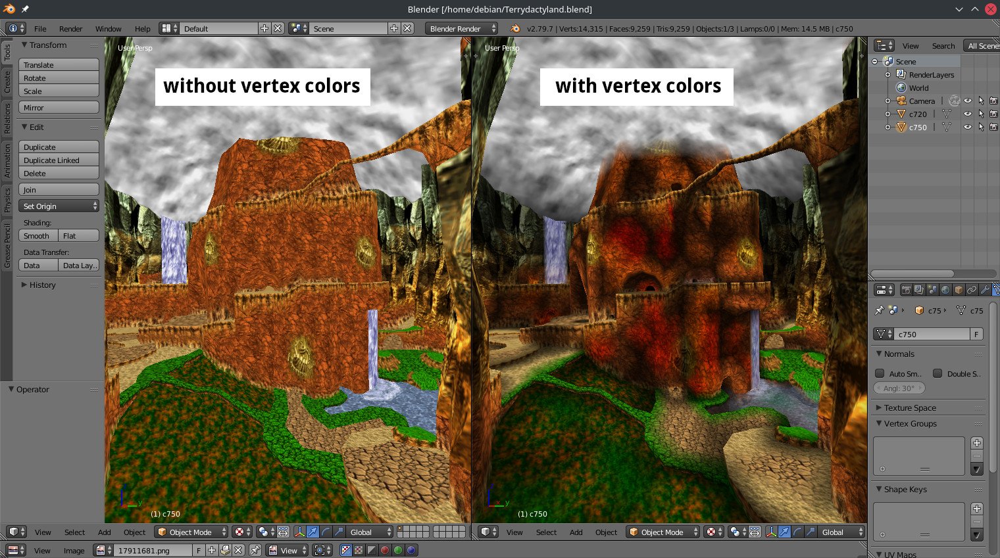

# io_scene_obj_rgba

Adds vertex color support to Blender's Wavefront OBJ importer, specifically for importing files exporting used [RareExports](https://github.com/RareExports) tools.

Install via *User Preferences - Install Addon from file*
[Blender 2.79.7c](https://download.blender.org/release/Blender2.79/latest/)
[Blender 2.79.4c](https://mega.nz/file/6FoHjT7I#FYo28fOblr3BzlHPOVGdWDO8zZuVbaaHOqz40dZx2A8)
[Blender 3.2](https://www.blender.org/download/releases/3-2/)

Legacy io_scene_obj_rgba is for DKViewer, as it wasn't updated to the newer spec

It expects vertices in Wavefront OBJ files to use the format:
```
v x y z r g b a
```

Where `r`, `g`, `b`, `a` are values `0 <= n <= 255`.

## Why vertex colors?

This screenshot speaks for itself:


